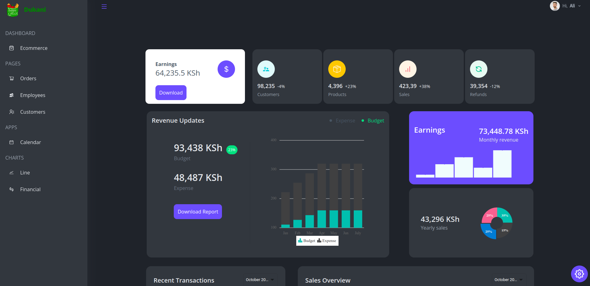
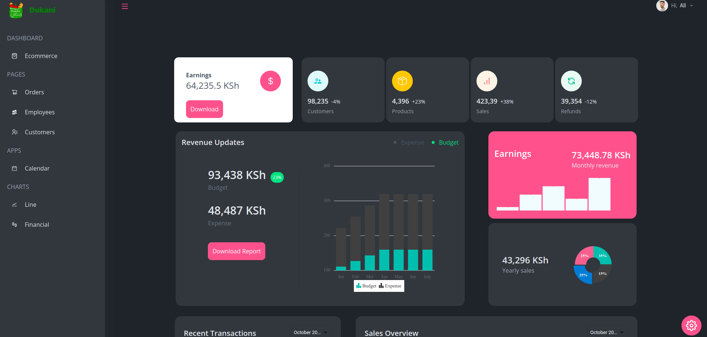

## PHASE 2 REACT PROJECT

### 0. Introduction

The [**E-commerce Admin-Dashboard**](https://ecommerce-admin-dashboard-khaki.vercel.app/) website application is a [Moringa School](https://moringaschool.com/) phase 2 react.js project.

### 1. Usage of Application

A user can access and do the following:
  
&check; Get earnings
 
&check; Get weekly/monthly/yearly statistics through
 
     &nbsp; &nbsp; &check; Bar charts 
     &nbsp; &nbsp; &check; Line Charts 
     &nbsp; &nbsp; &check; SparkLine chars 
&check; View orders status 
&check; View employees information 
&check; View customers details 
&check; View calendar and add todos 
&check; Visualize statics in graphs 
&check; Can change to theme 
&check; Can change to black or light mode 

### 2. Technologies

The following technologies was used to build the front-end of applications  

&check; React.js  
&check; Tailwind  
&check; Syncfusion UI  

### 3. Features
&check; The website has the following.  
&nbsp; &nbsp; &check; A Dark/Light mode. 
&nbsp; &nbsp; &check; Mobile responsive. 
&nbsp; &nbsp; &check; A theme color. 
&nbsp; &nbsp; &check; A Calendar app. 
&nbsp; &nbsp; &check; A charts. 

### 4. Home page 

### 5. Orders page

### 6. Employees page

### 7. Customers pages

### 8. Calenders

### 9. Line Charts

### 10. Financial Charts

### 11. Light mode

### 12. [Live Site](https://ecommerce-admin-dashboard-khaki.vercel.app/)

&check; Here is [Live Site](https://ecommerce-admin-dashboard-khaki.vercel.app/) deployed via Vercel.

### 13. Themes
 #### Theme 1
 

 #### Theme 2
 

 #### Theme 3
 

 #### Theme 4
 

### 14. LICENSE
&check; Here [MIT](./MIT) is project license.

### 15. Author 

 &check; Ilyas Ali
         
        &nbsp; &nbsp; &check; [LinkedIn](https://www.linkedin.com/in/ilyas-)
         
        &nbsp; &nbsp; &check; [Twitter](https://twitter.com/ilyasali_)
 